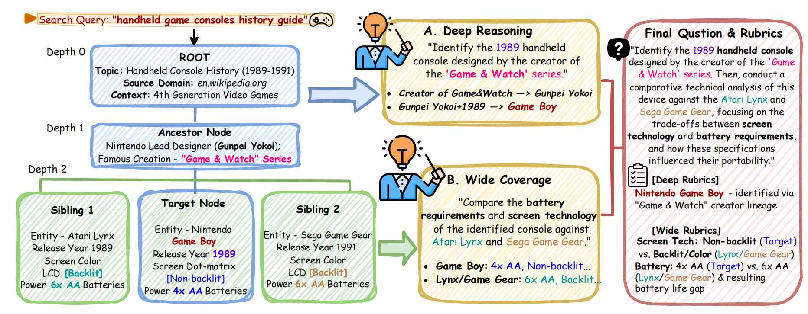

# DR-Arena: An Automated Evaluation Framework for Deep Research Agents
**Paper Link:** [https://arxiv.org/abs/2601.10504](https://arxiv.org/abs/2601.10504)

**DR-Arena** is a dynamic, automated benchmarking framework designed to evaluate the limits of **Deep Research (DR) Agents**. Unlike static benchmarks, DR-Arena constructs real-time **Information Trees** from live web trends and employs an **Adaptive Evolvement Loop** to dynamically escalate task complexity, testing agents on both **Deep Reasoning** (deduction depth) and **Wide Coverage** (information aggregation).


*Figure 1: Overview of the DR-Arena Framework. The Automated Examiner generates questions based on the Information Tree, and the Evolvement Loop dynamically adjusts task difficulty.*

## 🌟 Key Features

* **Dynamic Information Trees**: Automatically constructs navigable website structures (`web_tree`) mimicking real-world logic and noise, ensuring evaluation against the live state of the web.
* **Automated Examiner**: A specialized agent that synthesizes "Deep & Wide" questions based on the hidden topology of the generated trees, ensuring questions require multi-hop reasoning.
* **Adaptive Evolvement Loop**: A state-machine controller that monitors agent performance in real-time. If agents reach a stalemate, the system evolves the environment by increasing **Tree Depth** (logic complexity) or **Width** (search scope).
* **Automated Arena**: A tournament system supporting 1v1 battles between DR agents with automatic Elo rating calculation.

---

## 📂 Repository Structure

```text
DR-Arena/
├── core/                   # Core Arena Logic
│   ├── agents.py           # Search Agent Wrappers
│   ├── api_client.py       # OpenRouter API Client
│   ├── evolvement_loop.py  # Adaptive Evolvement Loop (State Machine)
│   ├── examiner.py         # Automated Examiner (Question Generation & Judging)
│   ├── score_utils.py      # Elo Scoring & Win-rate Calculation
│   ├── tracker.py          # Token Usage Tracking
│   └── utils.py            # General Utilities
├── web_tree/               # Dynamic Information Tree Generator
│   ├── data/               # Dataset Storage & Trends Source
│   ├── models/             # Data Models (WebsiteNode, LinkContext)
│   ├── utils/              # Generator Utilities (Crawler, LLM Agent, Validator)
│   ├── crawl.py            # Base Crawler Entry Point
│   ├── expand_tree.py      # Tree Expansion Tool
│   ├── generate_dataset.py # Automated Tree Generation Script
│   ├── test_components.py  # Component Verification Script
│   ├── visualize.py        # Tree Topology Visualization Tool
│   ├── QUICKSTART.md       # Generator Quick Start Guide
│   └── README.md           # Generator Documentation
├── tournament_cli.py       # Tournament Command Line Interface
├── main.py                 # Single-Match Entry Point
├── config.py               # Configuration Template
└── requirements.txt        # Project Dependencies
```

To ensure the reproducibility of the experiments reported in our paper, we have retained the **30 specific Information Trees** used in our evaluation.

* **Location**: `web_tree/data/dataset/trees/`
* **Description**: These 30 trees serve as the standardized "Hidden Knowledge" environments for the competition. They cover diverse domains (e.g., Technology, Finance, Science) and vary in initial topology, providing a consistent baseline for comparing new agents against the results reported in the paper.


*Figure 2: An example of a "Deep & Wide" Information Tree topology used in the evaluation.*

## 🚀 Quick Start

### 1. Installation

Requires Python 3.9+.

```bash
cd DR-Arena
pip install -r requirements.txt
```
### 2. Configuration

Add your API keys in `config.py` or export them as environment variables.


### 3. Running the Evaluation

#### Option A: Run a Tournament 
To replicate the full benchmarking process (Pairing -> Battling -> Ranking):

```bash
# 1. Initialize Pairing (Round 1)
python tournament_cli.py --action pair --round 1

# 2. Start Battles (Supports multi-worker parallelization)
python tournament_cli.py --action battle --worker_id 0 --total_workers 1

# 3. Calculate Elo Rankings
python tournament_cli.py --action rank
```

#### Option B: Single Match Debugging
To run a specific battle between two agents on a specific tree:

```bash
python main.py
```
Follow the interactive prompts to select a tree from `web_tree/data/` and define the contending agents.


## 🌲 Generating New Datasets (Optional)
If you wish to expand the benchmark with fresh data, use the web_tree module. This process scrapes live web data to build new Information Trees.
**Note**: For detailed instructions, please refer to `web_tree/README.md` and `web_tree/QUICKSTART.md`.

### Prerequisites
Ensure your API keys are set in `config.py` or exported as environment variables:

```bash
export ANTHROPIC_API_KEY='your-key-here'  # For Query Generation & Selection
export SERPAPI_API_KEY='your-key-here'    # For Google Search
```

### Step 1: Verify Components (Optional)
Before generating a large dataset, run the test suite to ensure all APIs are working:

```bash
python web_tree/test_components.py
```
This will verify the Trends Parser, LLM Agent, Search API, and Crawler connectivity.

### Step 2: Generate Trees
Run the generation script. You can customize the number of trees and their complexity:

```bash
cd web_tree
# Generate 50 new valid trees with a max depth of 3
python generate_dataset.py --target 50 --max-depth 3
```

**Parameters:**
- `--target`: Number of valid trees to generate (default: 100)
- `--max-depth`: Maximum crawl depth (default: 3)
- `--max-children`: Maximum links per node (default: 10)
- `--crawl-delay`: Safety delay between requests (default: 1.0s)


### Step 3: Visualize
You can inspect the topology of any generated tree using the visualization tool:

```bash
# Interactive Menu
python visualize.py data/dataset/trees/tree_0001.json

# Export a Clustered View (Recommended)
python visualize.py data/dataset/trees/tree_0001.json --style clustered
```


## 📜 Citation
If you use DR-Arena in your research, please cite our paper:
```bibtex
@misc{gao2026drarenaautomatedevaluationframework,
      title={DR-Arena: an Automated Evaluation Framework for Deep Research Agents}, 
      author={Yiwen Gao and Ruochen Zhao and Yang Deng and Wenxuan Zhang},
      year={2026},
      eprint={2601.10504},
      archivePrefix={arXiv},
      primaryClass={cs.CL},
      url={https://arxiv.org/abs/2601.10504}, 
}
```
